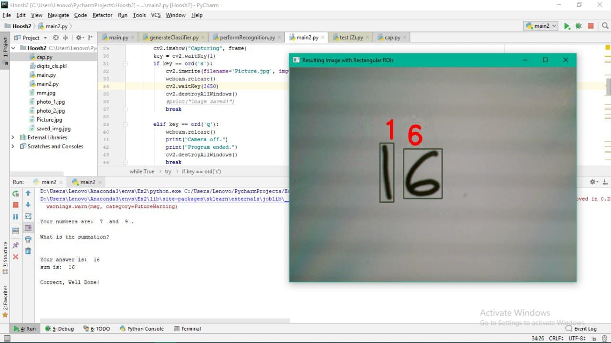

# Sum-for-Kids
 Undergrad project for "Introduction on Computational Intelligent" course.
 Hand written digit recognition using webcam - a game for children to write down the sum of two given numbers and show it to the webcam for assessment
 
 
 
<b>Sample test result:</b>

  
